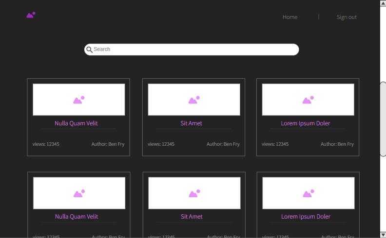

# Authorly

A web app for writing books

# Initial Diagrams for the database and website design

These were designed before anything else so that I could get a rough idea of what I wanted to do

###ER Diagram

###Website Flow Chart

# Website Initial Design

After figuring out how to use react to do what i want I set out to design the look of the wecsite so that I can code it in react

###Landing Page

this page is the portal into the site. 

- it is missing a button to go browse books without an accout but the final design will have one
- a note about every page: they are all mock ups and will have some differences from the final design (some things missing, extra stuff, etc...)

###Browse Page

this page is the page were a user can see all of the books that the author has marked as public, the books can be searched by title or author and I will try to add other search methods as well, including genre and language.

###Read Book

this page lets the user read chapters in a book and navigate through the book, I ~~might~~ probably will add cookies to remember what chapter a user left on

###login and sign up pages are pretty standard so I wont include them here, but they can be found in this git repository at res/img/Login.png and res/img/Signup.png respectively

###User Home

Signed in users will be able to access tehir books as well as browse other's public books

###My Books

this page will let an author access their books to edit them

###Edit Books

This will be where authors can work on their books, chapter by chapter (maybe not the best design but I like it and it will make it more fun to code)

I might include some other pages in the future but for now this is all
